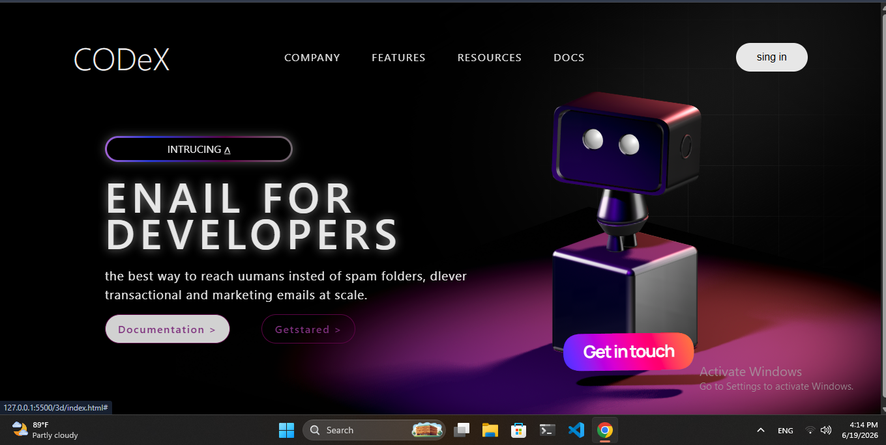

3D Landing Page
A modern landing page built using semantic HTML and CSS.

This project focuses on layout design, responsive structure, and smooth CSS animations.

Features
Semantic HTML structure
Responsive layout
CSS Flexbox & Grid
Modern UI design
CSS animations
Clean and organized code
Technologies Used
HTML5
CSS3
Flexbox
CSS Grid
CSS Animations
Preview
## Preview

Live Demo
You can view the live version here:

(Add GitHub Pages or Netlify link)

Project Goal
The goal of this project was to practice building modern UI layouts and improve front‑end development skills.

Author
Artas

Frontend Developer (Learning Journey)

